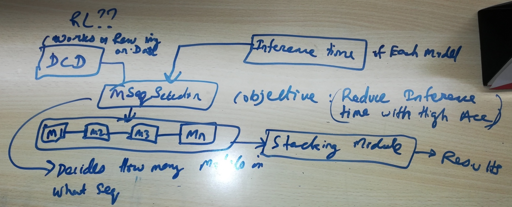

# Project/Publishable Ideas
For ideas to be viable it has to be computationally possible, and be programmable in Pytorch or keras or base python

### Open Questions
1. How to incorporate priors
2. Learning via concepts and training a model to find repeatable+understandable concepts
3. Brain Inspired Ideas: Another way of Transfer Learning
    - Focus/Regional Attention: We watch what catches our attention longer and remember it.
    - Drawing on Past knowledge and domain sub-setting
    - [Many Model hypothesis/ Thousand Brain Theory](https://numenta.com/blog/2019/01/16/the-thousand-brains-theory-of-intelligence/) 

### Deep Learning
1. Video Compression using DVAE, using super resolution techniques and Bidirectional LSTM time series

2. Snapshot Ensembling of Neural Networks
    - Instead of normal snapshot ensembling (where the idea is to increase LR after a local minima and then find a new minima and add it to existing snapshots) we propose a new method in which a new snapshot is only added to existing snapshots if it is significantly different from existing snapshots.
    - Lets say that our DNN has N parameters (weights), our error function is a function in the weight space. To determine if a snapshot is different we take it's Weight Wn and calculate cosine/euclid distances from all existing weights W1...n-1. If it is having significant difference above a threshold, then we take the snapshot.
    - A generalised process: Intelligent Snapshot selection to minimise overfitting and variance, and increase generalization. For example 1 process could be that the Validation error is lower than atleast half the existing snapshots and weight (Wn to W1..n-1 distance) distance should be above a threshold and predictions should be have less some threshold correlation.
    - https://medium.com/analytics-vidhya/snapshot-ensembles-leveraging-ensembling-in-neural-networks-a0d512cf2941
    
3. Text Augmentation Strategies
    - From Image Domain like Cutout and Label Smoothing
    - Sentence order change
    - Array rotate like circular rotation
    - Word Compressions
    - Adding Multi-task pre-trained embeddings
    - Gradcam for seeing which words are being more focused

4. How good is your Loss minima? Or How generalised is your model?
    - We do Random perturbations of weights. If some weights with perturbations do not change out-come then they are good weights.
    - Using this we can find over fit and generalization ability of model without looking at test set.

5. It's been clear for quite a while now that neural networks have trouble understanding the physical nature of objects. They don't seem to care very much when objects in an image don't 'hold together' in a physical sense, whereas humans immediately see that something is wrong.
    - I wonder how much of this discrepancy can be chalked up to humans having binocular vision? Or parallax generally? In general, we learn about physical objects by looking at real objects from multiple angles (either with our two eyes, or by rotating the object and/or ourselves around the object). This lets us get an idea in our heads of the 3D physical shapes of things and how they react to lighting in 3D space, and our reaction to 2D photographs is heavily informed by this background experience. On the other hand, I gather that pretty much all image-classification NN training uses separate images with no parallax and no 3D data to speak of, because that's what the big datasets tend to consist of; the NNs never get that background experience with parallax that we have. Maybe that's why they tend to ignore the 3D physicality of things and focus on texture-matching and such instead.
    

### RL
1. RL based tuning of Classification/Regression Models
    - https://towardsdatascience.com/how-to-improve-your-image-classifier-with-googles-autoaugment-77643f0be0c9
    - Feature Engineering like Google's Auto-Augment
    - Hyper-Params Optimization
    - Data Driven Understanding of what model works best for what metrics.
        - For example if imbalanced learn to apply Sampling/weighing techniques
        - If Categorical variables with lots of category then special handling
        - If categorical columns have semantic meaning then something like Word2Vec.
        
2. Data Adaptive Model Stacking for faster inference and competitive accuracy.
    - What we want to do
        - Use Existing SOTA Models (single models, not ensembles) 
        - Ensemble then in a new way
        - Beat each model's individual acc
        - Beat Voter/Averaging/Stacking Ensemble of them
        - Achieve faster inference speed than any other Ensemble method.
    - We will need RL to optimise for prediction time?
    - DCN: Data Characterization Network, 
        - Find characteristics of data that make it hard to classify
        - Find characteristics of data which make it better suited to a particular network and not others.
        - This would need the classifier to not be overfit to training data. As a result I can't use the test set to evaluate my initial classifiers. Use a 10-fold CV on training set.
        - Can we use Disentangled AutoEncoders here?
        - The output of DCN should correlate with overall Model performance not with single predictions. So for example if DCN (1 variable output version) outputs 1 for a set of images then we can expect that prediction accuracy on those set of images is high, while if it outputs 0 we can expect prediction accuracy to be low on those set of images. DCN's output of 1 / 0 is not correlated with actual prediction results, only with accuracy here.
        - Does training the DCN need to know which models we will use?
        - DCN input can be image(not augmented?)+All Models Prediction for it, DCN output is a multiclass classification (or probability of correctness?) of which model is going to be more correct/accurate. This way DCN will learn which model works where.
        - DCN is like stacking, we are finding which model works and when, if we use DCN output directly to combine models it should behave like stacking
        - DCN Tells things like - oh this image is really dark, low dynamic range, most of the image seems empty, so that `Master` can decide which network to use.
        - DCN may also have a internal classification model which has a good top-N (N=3 for CIFAR10?) accuracy, this is useful to tell the `Master` that it might be one of these `N` classes but not sure which, `Master` please Select the best model to distinguish.  
    - ModelSeqSelector/Master
        - Inputs: DCN,
        - simplest variant can work on just multiplying DCN probability to reach a threshold which is our required accuracy threshold.
            - Won't work: Imagine 3 networks with 98% accuracy each, perfectly correlated outputs. then combining them will give same 98%.
        - It decides which sub-networks to execute, once a subnet is executed it takes the output of the subnet and then decides whether it needs to run another subnet or it can send the results.
            - Can be implemented using an GRU/RNN which takes DCN + Current Model output + Time taken for Current Model, Outputs - Prediction, Whether Next Model is Needed to be run to reach our time and accuracy goal.  
        - A different variant from above can be a Master which pre-decides which networks to run and how to combine their predictions
    
3. RL adversarial examples, like if in a mario like game a ladder that moves horizontally suddenly starts moving vertically.
    - Time dependence / Length of observation needed to solve a RL problem. Maybe the agent needs to wait-observe-then-act based on very old past observation?
    - RL + GAN, can we have games/environment generators?
              

### Feature Engineering 
1. Categorical features where row/example has multiple categories
    - Method 1
        - Get WOE per category
        - See which categories the entity belongs to and take weighted (by num examples) / normal average of woe to arrive at final score.
    - Method 2
	    - Same as method 1 except that for each entity we also take nearest categories to its own categories for robustness
    - Method 3
        - Use Keras Embedding layer, feed categories as an array (like text), finally use GAP to get a vector
    - Method 4
        - Graphs and network methods, find nearest neighbors using graph, nodes are items and categories
        
2. Categorical features where categories have few examples
    - for low number of entiities category, get similar categories and use woe of nearby categories.
    - Getting Similar categories How?
    - Use a weighted by examples woe or Combine categories own woe with nearby cats' woe but give more weight to its own woe.
    - This will add more robustness and prevent too much variance for categories with less examples.
3. Idea is to not treat each category as completely distinct entities but rather have vector representations of categories where categories which are similar are nearer in the N-D vector space.
    - Keras Embeddding layer be default is trained to minimise loss, and could lead to high variance
    - First we will train embedding layer to minimise category aggregate statistics like mean,count,std.
    - Next We will train embedding layer to minimise loss in actual training
    - Keras Embedding layer can take only use only 1 categorical column, we will ensure that multiple categorical columns can be used at once.
        - Label Encoding and either Flatten or GAP  
    - This approach is very similar to auto-encoder approach but since it is also trained during main training it should find more interactions
    - 
4. Building Better Embedding Space for Regression problems by Converting the feature representation part into a comparator algorithm.
    - We then use the feature representation part as first part of our network. Since this is pre-initialised. It can perform better.
    - In short convert a regression problem to a ranking problem first, thereby expanding our data, then back to regression
5.  

### Trees and RFs
1. Explainable Trees
    - Each feature can be used only once in a path from root to leaf 
    - Each node is a b-tree node instead of binary node
    - B-tree nodes for categorical features will create as many branches as categorical variables cardinality.
    - For the categories that have less than x% of total example, we will put all of them into misc
    - we can also specify for a categorical column which categories can be misc
    
### Training and Tuning
1. Probabilistic Pruning of GridSearch CV Runs for speed.
    - Inspired from https://towardsdatascience.com/pruned-cross-validation-for-hyperparameter-optimization-1c4e0588191a
    - We estimate the above pdf of Model performance over hyperparameter space after each CV fold run.
    - When a new Hyperparam set is being evaluated, we will say that mean of that hyperparam set is mean of whatever folds has been evaluated for that set till now. 
    - Global mean and std are derived from all runs till now. As more runs happen, global mean and std will become clearer, similarly for current set also as more folds are processed its overall score (mean) will become clearer. 
    - Our pruning method takes 
       - Num total runs
       - Score of each run
       - current hyperparam set
       - current hyperparam set's num folds evaluated and score
    - Output of our pruning method - probability of current hyperparam set's score being lower than global mean/global best.
    - We prune (stop remaining folds of current hyper-params set to run) based on this probability
    

### Multi-Algorithm
1. Cohort based Linear Regression
    - Create cohorts/sub-groups of data using either clustering or Decision Trees
    - Add a penalty term for num of clusters/depth of tree so we have shallow trees. 
    - Run LR separately within each cohort
    - Easier explainability and faster training+inference
    
2. XGB + RF
    - Use XGB as base learner
    - Use RF as the ensembling method for multiple XGB
    - This can avoid the XGB overfitting
    - This can also provide confidence scores for each prediction
    
    
# Resources
https://roamanalytics.com/2016/10/28/are-categorical-variables-getting-lost-in-your-random-forests/

Video Compression

https://dsp.stackexchange.com/questions/35953/can-deep-learning-be-applied-to-video-compression
https://arxiv.org/abs/1804.09869
http://cs231n.stanford.edu/reports/2017/pdfs/423.pdf
https://towardsdatascience.com/tag2image-and-image2tag-joint-representations-for-images-and-text-9ad4e5d0d99